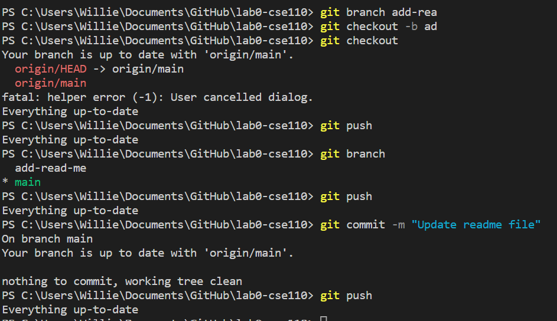
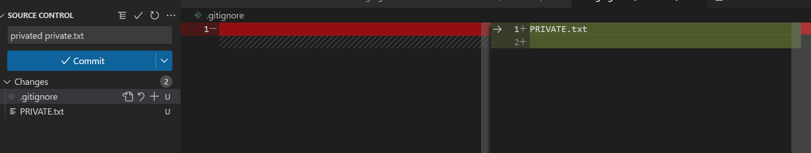
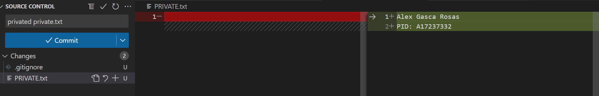

# The largest heading
## The second largest heading
###### The smallest heading

**This is bold text**

*This text is italicized*

~~This was mistaken text~~

**This text is _extremely_ important**

***All this text is important***

This is a subscript text

This is a superscript text

> Text that is a quote

Use `git status` to list all new or modified files that haven't yet been committed.

This site was built using [GitHub Pages](https://pages.github.com/).

[a link](# The largest heading)

- George Washington
- John Adams
- Thomas Jefferson

1. James Madison
2. James Monroe
3. John Quincy Adams

- [x] #739
- [ ] https://github.com/octo-org/octo-repo/issues/740
- [ ] Add delight to the experience when all tasks are complete :tada: